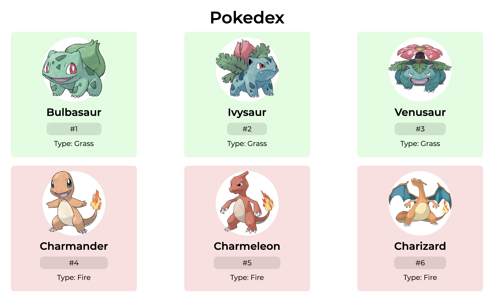

<h1 align="center">Pokedex App</h1>


<p align="center">
  


</p>



<h2 align="center"><a  href="https://aneudya4-pokedex.netlify.app/">Live Demo</a></h2>

### [Contributions are Welcome](https://github.com/aneudya4/pokedex.git)

## Description


<h2 align="center">Pokedex is ReactJs app in which i use the pokeapi to get all the data.</h2>
<p align="center">
</p>


### Project setup:

```bash
git clone https://github.com/aneudya4/pokedex.git
cd pokedex
npm install
npm run start
open http://localhost:3000
```


## Future scope:
- Filtering pokemons by name or type
